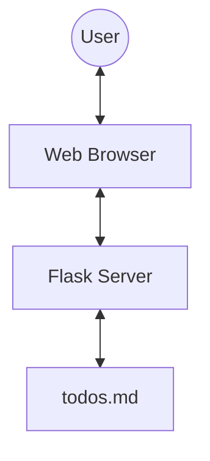

# Architecture Overview

Taskr is a lightweight, responsive To-Do application built with a Flask backend and a modern vanilla JavaScript frontend.

## 🏗️ System Architecture



### 🔹 Backend (Flask)
The backend is a single-file Flask application (`app.py`) that handles:
- **API Endpoints**: CRUD operations for lists and tasks.
- **Data Persistence**: Stores data in `todos.md` using a custom Markdown parser/serializer. This allows for human-readable data storage.
- **Daily Reset Logic**: Automatically resets tasks marked as `#daily` when the server is accessed on a new day.

### 🔹 Frontend (Vanilla JS & CSS)
The frontend (`templates/index.html`) is designed for maximum performance and visual appeal:
- **Single Page Application**: Uses AJAX/Fetch for all operations, providing a smooth, non-reloading experience.
- **Interactive Components**:
    - Custom drag-and-drop system for task reordering.
    - Real-time priority tag autocomplete suggestions.
    - Responsive sidebar navigation.
- **State Management**: Maintains an in-memory `STATE` object that is synchronized with the backend.

### 🔹 Storage Format (`todos.md`)
Tasks are stored in a standard Markdown list format:
```markdown
## Work
- [ ] Review documentation #urgent @alice
- [x] Setup project #high
```
Metadata like priorities (`#tag`) and assignees (`@name`) are parsed dynamically.
